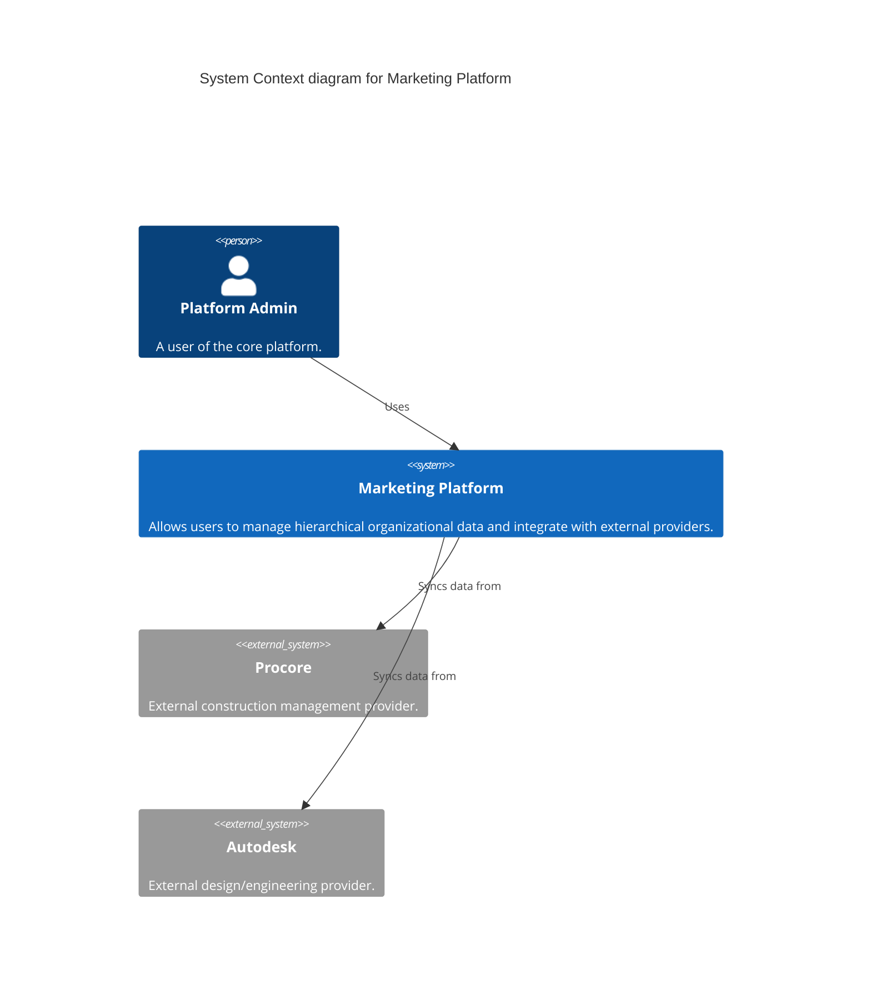
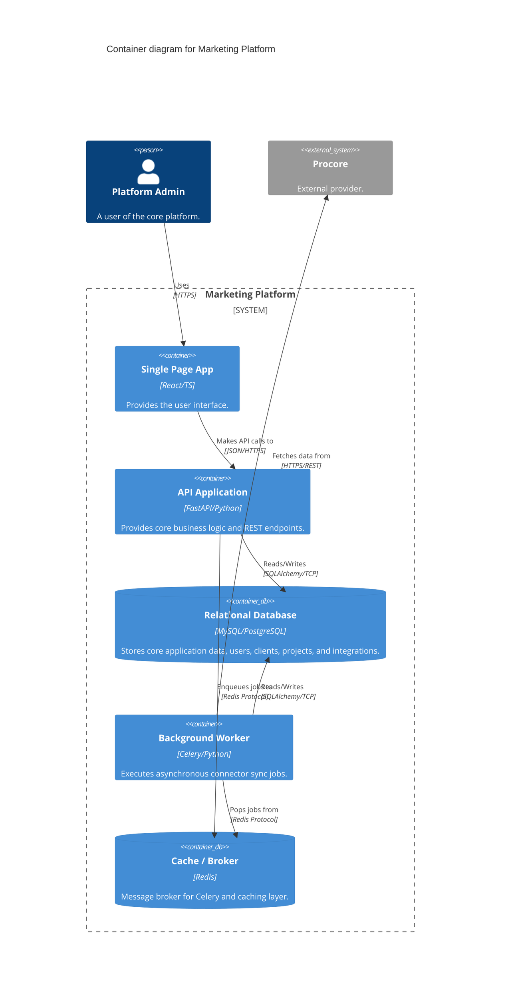

# C4 Architecture Model

This document provides the C4 Context and Container diagrams for the platform.

## Context Diagram (Level 1)

```mermaid
C4Context
    title System Context diagram for Marketing Platform
    
    Person(admin, "Platform Admin", "A user of the core platform.")
    System(marketing_platform, "Marketing Platform", "Allows users to manage hierarchical organizational data and integrate with external providers.")
    
    System_Ext(procore, "Procore", "External construction management provider.")
    System_Ext(autodesk, "Autodesk", "External design/engineering provider.")

    Rel(admin, marketing_platform, "Uses")
    Rel(marketing_platform, procore, "Syncs data from")
    Rel(marketing_platform, autodesk, "Syncs data from")
```

## Container Diagram (Level 2)

```mermaid
C4Container
    title Container diagram for Marketing Platform
    
    Person(admin, "Platform Admin", "A user of the core platform.")
    
    System_Boundary(marketing_platform, "Marketing Platform") {
        Container(spa, "Single Page App", "React/TS", "Provides the user interface.")
        Container(api, "API Application", "FastAPI/Python", "Provides core business logic and REST endpoints.")
        ContainerDb(db, "Relational Database", "MySQL/PostgreSQL", "Stores core application data, users, clients, projects, and integrations.")
        Container(worker, "Background Worker", "Celery/Python", "Executes asynchronous connector sync jobs.")
        ContainerDb(cache, "Cache / Broker", "Redis", "Message broker for Celery and caching layer.")
    }

    System_Ext(procore, "Procore", "External provider.")

    Rel(admin, spa, "Uses", "HTTPS")
    Rel(spa, api, "Makes API calls to", "JSON/HTTPS")
    Rel(api, db, "Reads/Writes", "SQLAlchemy/TCP")
    Rel(api, cache, "Enqueues jobs to", "Redis Protocol")
    Rel(worker, cache, "Pops jobs from", "Redis Protocol")
    Rel(worker, db, "Reads/Writes", "SQLAlchemy/TCP")
    Rel(worker, procore, "Fetches data from", "HTTPS/REST")
```
