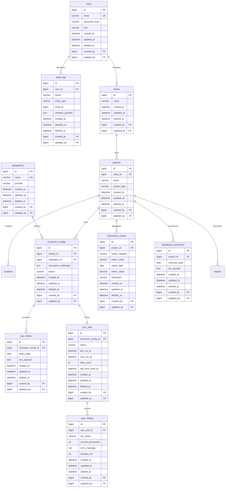

# Database Architecture & ERD
## Marketing Intelligence Platform - MySQL Version 1.0

## 1. Entity Relationship Diagram (ERD)

## 2. Table-by-Table Documentation & 4. Index Strategy

*Note: All tables inherit the standard Audit Fields: `created_at` (DATETIME), `updated_at` (DATETIME), `deleted_at` (DATETIME, indexed for soft deletes), `created_by` (BIGINT FK), `updated_by` (BIGINT FK).*

### Core Entities
#### `users`
- **Purpose:** Stores authenticated platform users (Marketing Team).
- **Columns:** `id` (BIGINT, PK), `email` (VARCHAR(255), UK), `password_hash` (VARCHAR(255)), `role` (ENUM: Admin, Manager, Analyst).
- **Indexes:** `idx_users_email` (email).

#### `clients`
- **Purpose:** Represents a top-level marketing client.
- **Columns:** `id` (BIGINT, PK), `name` (VARCHAR(255)).
- **Indexes:** `idx_clients_name` (name).

#### `projects`
- **Purpose:** A specific property (Website, App) owned by a client.
- **Columns:** `id` (BIGINT, PK), `client_id` (BIGINT, FK to clients), `name` (VARCHAR(255)), `project_type` (ENUM: Website, Mobile, Campaign).
- **Indexes:** `idx_projects_client` (client_id).

#### `locations`
- **Purpose:** Geographic locations linked to GEO campaigns.
- **Columns:** `id` (BIGINT, PK), `project_id` (BIGINT, FK to projects), `address` (VARCHAR(500)), `latitude` (DECIMAL), `longitude` (DECIMAL).
- **Indexes:** `idx_locations_project` (project_id).

### Integration & Synchronization
#### `integrations`
- **Purpose:** A lookup table of supported connectors.
- **Columns:** `id` (BIGINT, PK), `name` (VARCHAR(100), UK), `provider` (VARCHAR(100)). Example: Google Analytics, Meta Ads.

#### `connector_configs`
- **Purpose:** Links a project to an integration with encrypted credentials.
- **Columns:** `id` (BIGINT, PK), `project_id` (BIGINT, FK), `integration_id` (BIGINT, FK), `encrypted_credentials` (TEXT), `status` (ENUM: Active, Error, Inactive).
- **Unique Constraint:** `uq_project_integration` (project_id, integration_id).

#### `sync_jobs`
- **Purpose:** Queue and state management for Celery background tasks.
- **Columns:** `id` (BIGINT, PK), `connector_config_id` (BIGINT, FK, UK), `status` (ENUM: Pending, Running, Failed, Success), `last_run_at` (DATETIME), `next_run_at` (DATETIME), `retry_count` (INT), `rate_limit_reset_at` (DATETIME).
- **Indexes:** `idx_sync_next_run` (status, next_run_at) - Critical for Celery beat querying.

#### `sync_history`
- **Purpose:** Audits every execution of a sync job.
- **Columns:** `id` (BIGINT, PK), `sync_job_id` (BIGINT, FK), `run_status` (ENUM: Success, Failed), `records_processed` (INT), `error_message` (TEXT), `duration_ms` (INT).
- **Indexes:** `idx_sync_hist_job_date` (sync_job_id, created_at).

### Metrics Pipeline
#### `raw_metrics`
- **Purpose:** Stage 1 of ingestion. Pure JSON responses for audit and recovery.
- **Columns:** `id` (BIGINT, PK), `connector_config_id` (BIGINT, FK), `metric_date` (DATE), `raw_payload` (JSON).
- **Composite Index:** `idx_raw_connector_date` (connector_config_id, metric_date).
- **Unique Constraint:** `uq_raw_connector_date` to enforce idempotency.

#### `normalized_metrics`
- **Purpose:** Stage 2. Cleaned, typed time-series data.
- **Columns:** `id` (BIGINT, PK), `project_id` (BIGINT, FK), `metric_category` (VARCHAR), `metric_name` (VARCHAR), `metric_date` (DATE), `metric_value` (DECIMAL(18,4)), `dimension` (VARCHAR).
- **Composite Index:** `idx_norm_project_category_date` (project_id, metric_category, metric_date). This index allows extremely fast range queries for charts.
- **Unique Constraint:** `uq_norm_metric` (project_id, metric_name, dimension, metric_date) for `UPSERT` operations.

#### `dashboard_summaries`
- **Purpose:** Stage 3. Pre-calculated KPI blocks for the UI.
- **Columns:** `id` (BIGINT, PK), `project_id` (BIGINT, FK), `summary_date` (DATE), `kpi_payload` (JSON).
- **Unique Constraint:** `uq_summary_project_date` (project_id, summary_date).

### Logging
#### `audit_logs`
- **Purpose:** Tracks all user mutations (RBAC and security compliance).
- **Columns:** `id` (BIGINT, PK), `user_id` (BIGINT, FK), `action` (VARCHAR), `entity_type` (VARCHAR), `entity_id` (BIGINT), `changes_payload` (JSON).
- **Indexes:** `idx_audit_entity` (entity_type, entity_id).

## 3. Relationship Explanations & Cardinality

- **Client 1 : N Projects:** A single client organization can own multiple websites or apps. This prevents duplicate client entries and ensures billing/reporting scales properly.
- **Project 1 : N Connector Configs:** A project aggregates data from multiple sources (e.g., SEO from Ahrefs, traffic from GA).
- **Connector Config 1 : 1 Sync Job:** Each configured integration has exactly one active heartbeat/job state regulating its ingestion cycle to avoid race conditions.
- **Sync Job 1 : N Sync History:** A job generates a historical execution log every time it runs, crucial for observability.
- **Project 1 : N Normalized Metrics:** The central nervous system of the platform. Projects link directly to their metrics to bypass joining through Connector Configs, vastly improving dashboard query speeds.

## 5. Migration Order (Alembic)
1. `users` (No dependencies)
2. `audit_logs` (Depends on users)
3. `clients` (Depends on users for audit fields)
4. `projects` (Depends on clients)
5. `locations` (Depends on projects)
6. `integrations` (No dependencies)
7. `connector_configs` (Depends on projects, integrations)
8. `sync_jobs` (Depends on connector_configs)
9. `sync_history` (Depends on sync_jobs)
10. `raw_metrics` (Depends on connector_configs)
11. `normalized_metrics` (Depends on projects)
12. `dashboard_summaries` (Depends on projects)

## 6. Example Records

**`normalized_metrics`**
| id | project_id | metric_category | metric_name | metric_date | metric_value | dimension |
|---|---|---|---|---|---|---|
| 1 | 42 | SEO | organic_traffic | 2024-02-15 | 15400.00 | google |
| 2 | 42 | MetaAds | cpa | 2024-02-15 | 45.50 | campaign_a |

**`dashboard_summaries`**
| id | project_id | summary_date | kpi_payload |
|---|---|---|---|
| 1 | 42 | 2024-02-15 | `{"total_traffic": 15400, "avg_cpa": 45.5, "active_campaigns": 3}` |

## 7. Database Design Rationale

1. **Decoupling Ingestion from Presentation:**
   By forcing all external data to hit `raw_metrics` first, the system is immune to API schema changes. Normalization happens asynchronously, and the UI solely reads from `dashboard_summaries`.
2. **Idempotency via Unique Constraints:**
   Celery workers will inevitably fail and retry. Constraints like `uq_norm_metric` guarantee that an `INSERT ... ON DUPLICATE KEY UPDATE` will overwrite rather than duplicate metric data.
3. **Soft Delete Strategy:**
   Marketing data is extremely valuable. `deleted_at` ensures that if a user deletes a Client, the database records remain intact but filtered out by SQLAlchemy (`WHERE deleted_at IS NULL`). This prevents accidental data loss and preserves historical referential integrity.
4. **Performance & Archiving (Future):**
   The `normalized_metrics` table will grow by millions of rows rapidly. For Version 1, composite indexes handle this. In Version 2, MySQL table partitioning by `metric_date` (e.g., partitioned by month) is easily achievable because `metric_date` is part of the unique constraints.
5. **JSON Payloads:**
   Using MySQL `JSON` columns in `raw_metrics` and `dashboard_summaries` provides NoSQL flexibility where rigid schemas add no value, while `normalized_metrics` maintains strict types for fast aggregations.
