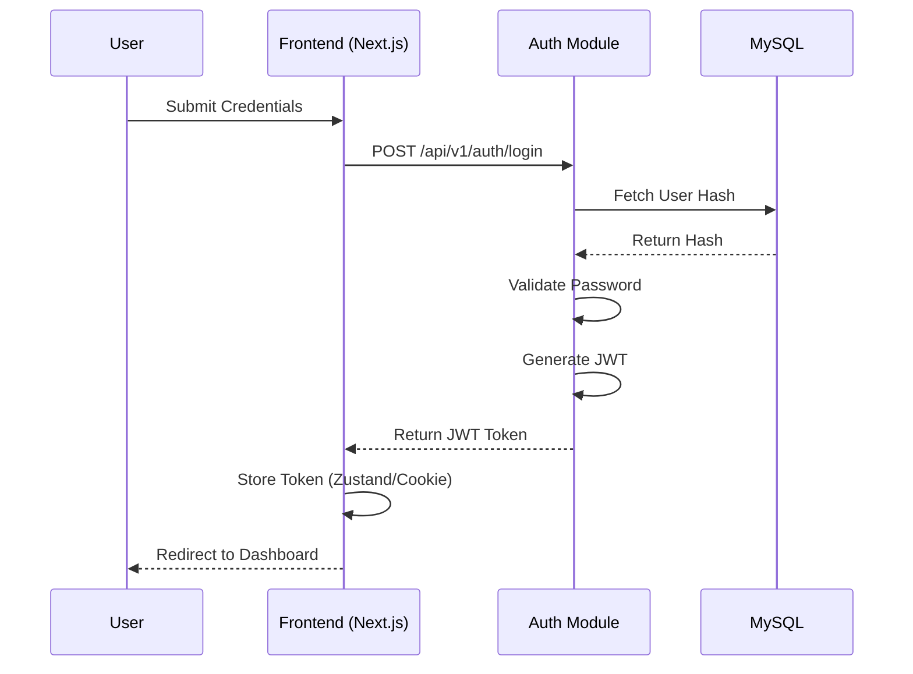
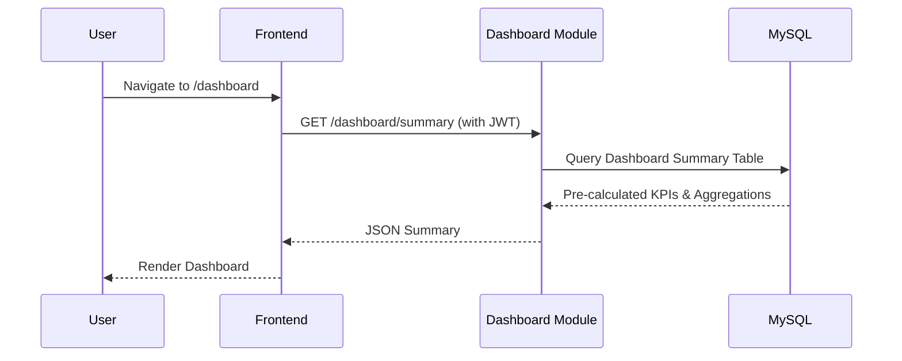
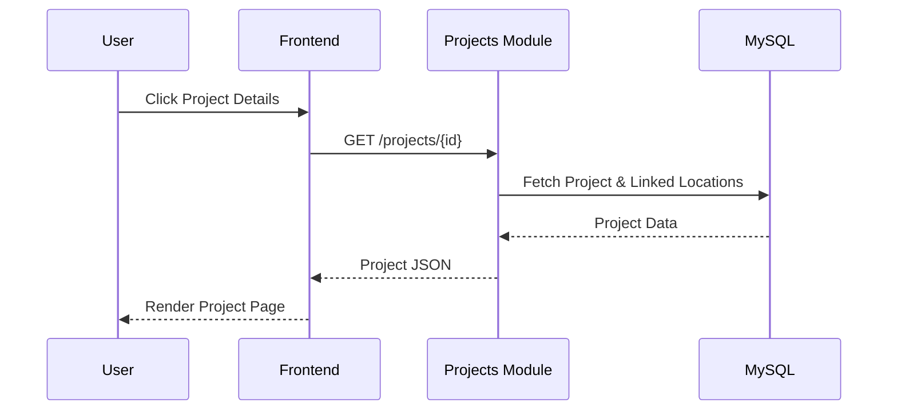
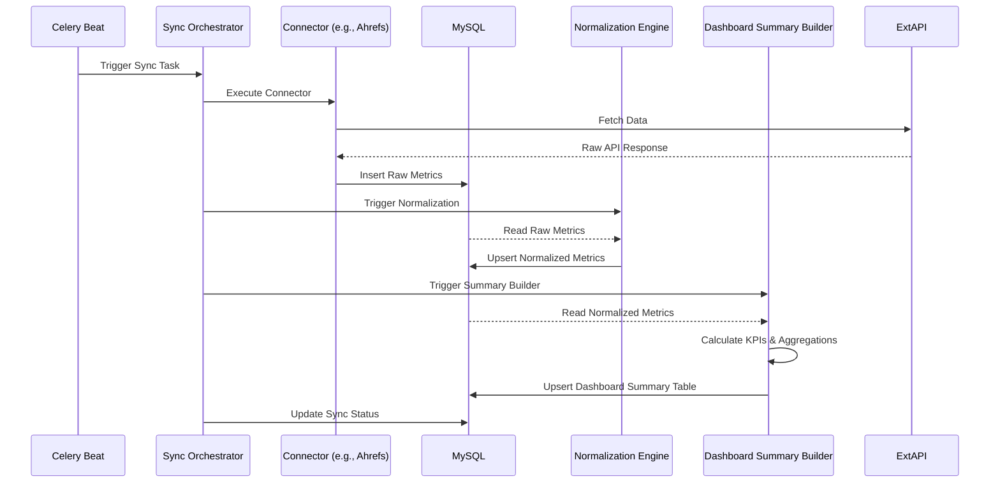
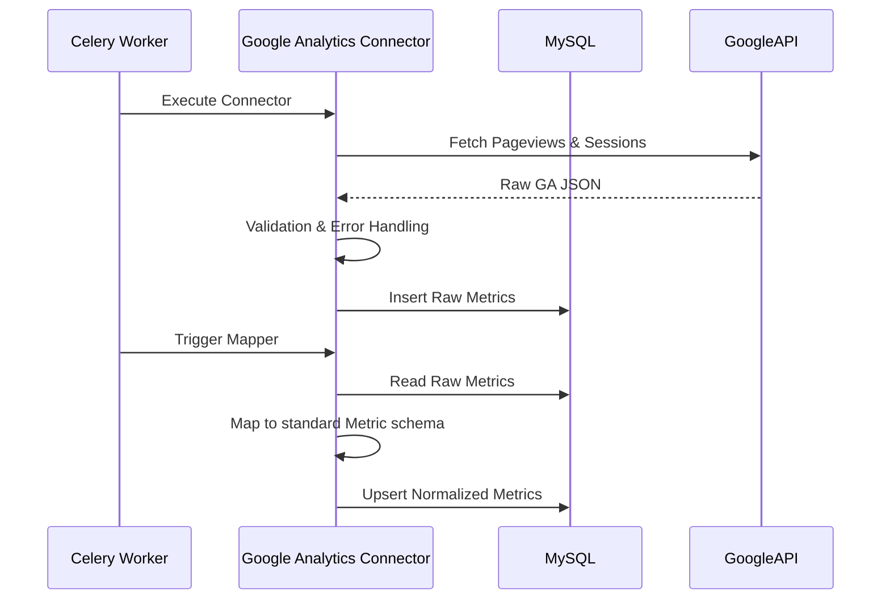
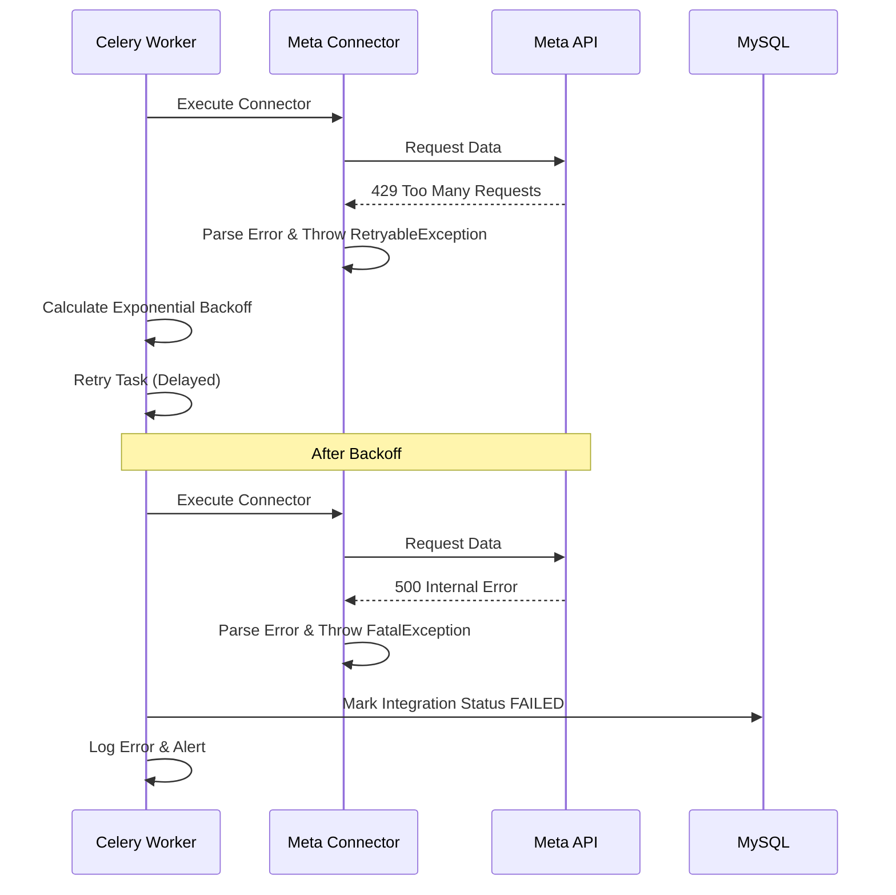
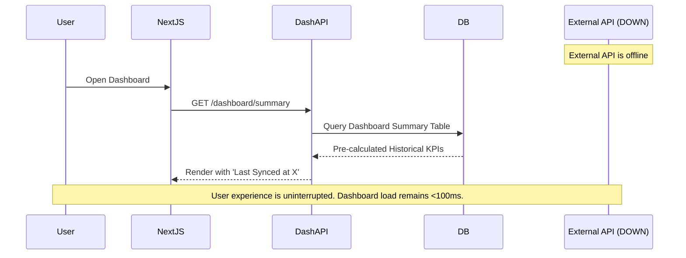
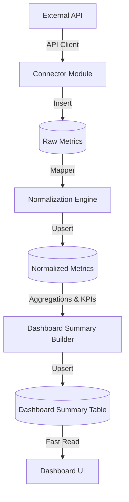
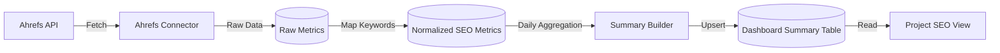

# Software Architecture Design (SAD)
## Marketing Intelligence Platform - Version 1.0

## 1. Architecture Overview
The Marketing Intelligence Platform is designed using a **Modular Monolith** architecture. 
**Why Modular Monolith?**
- **Maintainability:** By strictly separating domain logic into self-contained modules, the codebase remains organized without the operational complexity of microservices.
- **Reliability (Decoupled Reads):** The dashboard (reads) operates independently of external API integrations. External APIs are queried via background Celery workers, pushing data into MySQL through a staged ingestion pipeline.
- **Scalability:** Background workers can be scaled horizontally independent of the API web servers.

## 2. Responsibilities of Every Module

### 2.1 Authentication
- **Purpose**: Manage system access and identity verification.
- **Responsibilities**: Login, Token Generation (JWT), Token Validation, Password Verification.
- **Dependencies**: None.
- **Data Owned**: Users, Passwords, Roles.
- **Data Consumed**: None.

### 2.2 Clients
- **Purpose**: Manage marketing clients.
- **Responsibilities**: CRUD for client entities, linking clients to projects.
- **Dependencies**: Authentication (for access control).
- **Data Owned**: Client profiles, Status, Contact info.
- **Data Consumed**: None.

### 2.3 Projects
- **Purpose**: Manage projects (Websites, Apps, Campaigns) owned by clients.
- **Responsibilities**: CRUD for projects, linking projects to locations and integrations.
- **Dependencies**: Clients.
- **Data Owned**: Project profiles, Types, Status.
- **Data Consumed**: Client IDs.

### 2.4 Locations
- **Purpose**: Manage physical business addresses linked to projects.
- **Responsibilities**: CRUD for physical locations (GEO data).
- **Dependencies**: Projects.
- **Data Owned**: Address, Coordinates, Region.
- **Data Consumed**: Project IDs.

### 2.5 Integrations (Connectors)
- **Purpose**: Manage credentials, configurations, and data ingestion for external platforms.
- **Responsibilities**: Dedicated connectors fetch data from third-party APIs. Each connector is completely isolated from every other connector and contains its own:
  - API Client
  - Mapper
  - Validation
  - Error Handling
- **Modules**:
  - `Google Analytics Connector`
  - `Google Search Console Connector`
  - `Meta Connector`
  - `Ahrefs Connector`
  - `SEMrush Connector`
- **Dependencies**: Projects, Security (Encryption).
- **Data Owned**: API Keys, Tokens (Encrypted), Provider details.
- **Data Consumed**: Project IDs.

### 2.6 Synchronization
- **Purpose**: Orchestrate data ingestion from Connectors.
- **Responsibilities**: Schedule background jobs, handle rate limits, manage retries across Connectors.
- **Dependencies**: Integrations (Connectors), Metrics.
- **Data Owned**: Sync Job Status, Last Sync Timestamps.
- **Data Consumed**: Integration Credentials.

### 2.7 Metrics
- **Purpose**: Multi-stage processing and storage for all marketing data.
- **Responsibilities**: 
  - **Raw Metrics**: Store the untouched JSON response directly from the Connector for audit and replayability.
  - **Normalization**: Transform raw data into a standardized schema.
  - **Normalized Metrics**: Serve as the core time-series store for all standardized data.
- **Dependencies**: Projects, Locations.
- **Data Owned**: Raw Metrics, Normalized Metrics (SEO, Meta, Content).
- **Data Consumed**: Project IDs, Location IDs.

### 2.8 Dashboard
- **Purpose**: Serve aggregated, high-level views of the platform state.
- **Responsibilities**: Provide lightning-fast read operations for the UI. The dashboard **must only read Dashboard Summary data whenever possible**.
- **Dashboard Summary Builder**: A dedicated background process that reads Normalized Metrics to compute aggregations, KPI calculations, and daily summaries.
- **Dashboard Summary Table**: Pre-calculated, heavily indexed tables optimized for the Dashboard UI.
- **Dependencies**: Clients, Projects, Metrics, Integrations.
- **Data Owned**: Dashboard Summary Table (Aggregations).
- **Data Consumed**: Normalized Metrics.

### 2.9 Reports
- **Purpose**: Generate structured outputs for the marketing team.
- **Responsibilities**: Export data (CSV/PDF), generate scheduled summaries.
- **Dependencies**: Metrics, Projects.
- **Data Owned**: Report templates, Generated report metadata.
- **Data Consumed**: Normalized Metrics.

## 3. Sequence Diagrams

### User Login

### Open Dashboard

### View Client & View Project

### Background Synchronization (Multi-Stage)

### Google Analytics Synchronization

### Integration Failure & Retry Process

### Dashboard Loading (Resiliency)

## 4. Data Flow Diagrams

### Unified Ingestion Flow

### Major Feature Flow: SEO Tracking

## 5. Non-Functional Requirements (NFRs)
- **Availability:** The Dashboard must remain available even if 100% of external integrations are offline. Target: 99.9% uptime for the UI.
- **Reliability:** Data must not be corrupted or duplicated during ingestion failures.
- **Performance:** End-user interactions must feel instantaneous. Heavy aggregations must be offloaded to background workers.
- **Maintainability:** New integrations must be added strictly by creating new Connectors, requiring zero modifications to existing Connectors or the Normalization engine.
- **Security:** All PII and external credentials must be encrypted at rest and in transit.
- **Observability:** Complete visibility into every background job, API request, and database query latency.
- **Recoverability:** The system must be able to completely rebuild the Normalized Metrics and Dashboard Summary Tables using the stored Raw Metrics.
- **Disaster Recovery:** RTO (Recovery Time Objective) of 4 hours. RPO (Recovery Point Objective) of 1 hour.
- **Backup Strategy:** Nightly automated MySQL snapshots with point-in-time recovery enabled.

## 6. Performance Objectives
- **Dashboard Load Time:** < 500ms (95th percentile).
- **API Response Time:** < 200ms (95th percentile) for all read operations.
- **Database Query Time:** < 50ms for Dashboard Summary Table lookups.
- **Background Synchronization Time:** < 5 minutes per project sync.
- **Worker Queue Delay:** < 60 seconds from schedule time to task execution.
- **Availability Target:** 99.9% (approx 43 minutes allowed downtime/month).
- **Error Rate:** < 1% of total API requests resulting in 5xx HTTP codes.

## 7. Reliability Strategy
- **Retry Policy:** Connectors utilize exponential backoff for network errors and 429 rate limits.
- **Timeout Policy:** All external HTTP requests have strict timeouts (e.g., 10s connect, 30s read).
- **Circuit Breaker (Future):** Stop querying an API if it fails 5 times in a row, preventing quota burning.
- **Failure Isolation:** Connectors are strictly isolated. A failure in the `Ahrefs Connector` has zero impact on the `Meta Connector`.
- **Idempotency:** Background workers use `UPSERT` operations. Replaying a sync job overwrites rather than duplicates data.
- **Dead Letter Queue (Future):** Failed synchronization messages are sent to a DLQ for manual inspection.
- **Audit Logging:** Security-sensitive actions (login, adding integrations) are permanently logged.
- **Health Checks:** `/health` endpoints monitor Database and Redis connectivity.
- **Graceful Degradation:** Expired integration tokens simply show historical data with a warning flag.

## 8. Scalability Strategy
- **Horizontal Scaling:** FastAPI is stateless (JWT). Deploy multiple API containers behind a load balancer.
- **Background Workers:** Scale Celery workers horizontally by adding more containers reading from Redis.
- **Database Indexing:** `Dashboard Summary Table` is aggressively indexed for UI query patterns.
- **Future Partitioning:** MySQL `Raw Metrics` and `Normalized Metrics` tables can be partitioned by `date` as the dataset grows.
- **Caching Strategy (Future):** Redis can cache heavily accessed Dashboard Summaries, bypassing MySQL entirely.
- **Read Replicas (Future):** Route Dashboard reads to a MySQL replica, isolating them from background ingestion writes.
- **Modular Extraction (Future):** The `Synchronization` module and Connectors can be extracted into a standalone microservice later.

## 9. Security Strategy
- **Authentication:** Stateless JSON Web Tokens (JWT) stored in HTTP-only secure cookies or memory.
- **Authorization:** Role-based access control (RBAC).
- **JWT Lifecycle:** Short-lived access tokens (15 mins) with refresh token rotation.
- **Secrets Management:** External API keys are AES-encrypted at rest in MySQL using a Master Key provided via environment variables.
- **Encryption:** TLS 1.3 enforced for all internal and external API communications.
- **Password Hashing:** `bcrypt` with automatic salting.
- **Rate Limiting:** FastAPI middleware throttles excessive login attempts.

## 10. Logging Strategy
- **Application Logs:** Structured JSON logging using `structlog`.
- **Audit Logs:** Dedicated DB table tracking `who`, `did what`, `when` for critical actions.
- **Synchronization Logs:** Celery logs detailing connector execution times and HTTP response codes.
- **Error Logs:** All unhandled exceptions logged with full stack traces.
- **Performance Logs:** Log query execution times exceeding 500ms.
- **Log Retention:** Hot storage for 30 days, archived to cold storage thereafter.

## 11. Monitoring Strategy
- **Health Endpoints:** Exposes `/api/v1/health` providing DB and Redis connectivity status.
- **Metrics:** Prometheus endpoint to track API latency, error rates, and active requests.
- **System Status:** Dashboard indicates when external APIs are experiencing known outages.
- **Dashboard Freshness:** UI displays the `last_synced_at` timestamp.
- **Failed Synchronizations:** Alerts triggered when connectors fail to sync for 24+ hours.

## 12. Error Handling Strategy
- **Standard Format:** Every error returns a standardized JSON structure.
- **Business Exceptions:** Defined in `app/core/exceptions.py`.
- **Infrastructure Exceptions:** Database disconnects mapped to standard 503 responses.
- **Validation Errors:** Handled globally by Pydantic and returned as structured 422 responses.
- **Retryable vs Non-Retryable:** Connectors differentiate between 503 (Retryable) and 401 Unauthorized (Non-Retryable).

## 13. Engineering Standards
- **Folder Ownership:** Enforced bounded contexts. Connectors cannot access each other's code.
- **Naming Conventions:** `camelCase` for JS/TS, `snake_case` for Python, `PascalCase` for Classes/Models.
- **Coding Conventions:** Strict type hinting in Python, strict mode in TypeScript.
- **Repository Pattern:** SQL queries are strictly confined to `repository.py` files.
- **Dependency Injection:** FastAPI `Depends` is used to inject database sessions.
- **Testing Strategy:** `pytest` for backend unit tests. Connectors must use mocked HTTP responses for testing.
- **Documentation Standards:** API auto-documented via Swagger UI. 

## 14. Architecture Decision Records (ADR)
Architecture Decision Records capture important architectural decisions made along with their context and consequences. 

**Why ADRs?**
ADRs are crucial for long-term maintainability. As the team grows and changes, ADRs provide historical context explaining *why* a specific technology or pattern was chosen, preventing cyclical debates and preserving institutional knowledge.

**Example ADR Structure:**
Located at `/docs/architecture/ADR/`
- `0001-modular-monolith.md`
- `0002-mysql.md`
- `0003-celery.md`
- `0004-jwt.md`
- `0005-staged-metrics-ingestion.md`

## 15. Future Evolution (V2 / V3)
The Modular Monolith guarantees that the system can evolve without breaking the foundational architecture:
- **Automation (V2):** Add an `Automation` module that listens to `Normalized Metrics` events (e.g., Meta Ad CPA > $50 triggers a pause action).
- **Notifications (V2):** Integrate with Slack/Email to alert the marketing team.
- **AI Recommendations (V3):** Periodically read `Normalized Metrics` using OpenAI to generate SEO suggestions.
- **Client Portal (V3):** Transition from "Internal Only" by adding a frontend with restricted Row-Level Security.
- **Scheduling (V3):** Automatically email weekly Dashboard Summaries to executives.
- **Additional Integrations:** Adding new data sources requires strictly building a new isolated Connector module.
